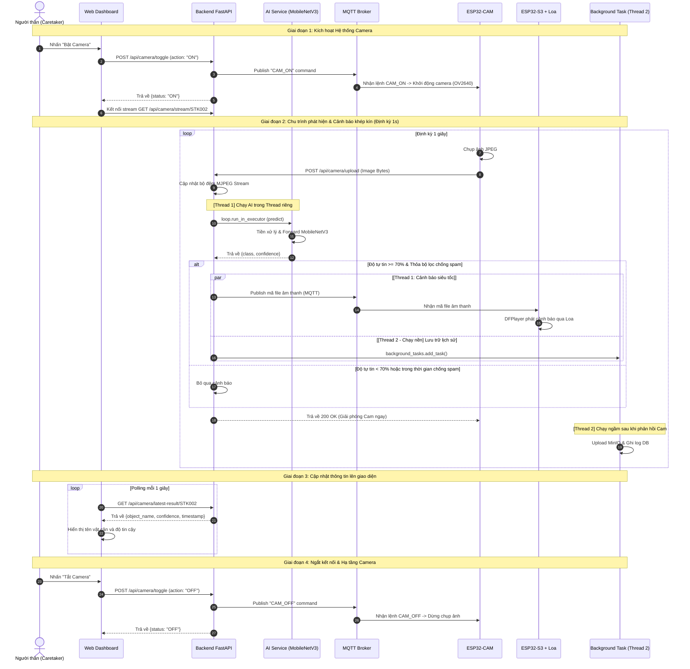

# Báo cáo Luồng Hoạt động Hệ thống Gậy Thông minh (Smart Blind Stick)

Hệ thống bao gồm 3 thành phần chính hoạt động kết hợp: **Thiết bị phần cứng (Hardware)**, **Máy chủ dịch vụ (FastAPI Backend Server + AI Model)** và **Trang quản lý (Web Dashboard)**.

Dưới đây là mô tả chi tiết các luồng dữ liệu chính phục vụ cho báo cáo.

---

## 1. Sơ đồ Kiến trúc Hệ thống (Mermaid Diagram)

```mermaid
graph TD
    subgraph Hardware ["Thiết bị phần cứng (Smart Stick)"]
        S3["ESP32-S3 (Bộ xử lý chính)"]
        CAM["ESP32-CAM (Truyền hình ảnh)"]
        MPU["MPU6050 (Cảm biến IMU)"]
        GPS["Module GPS Neo-6M"]
        DFP["DFPlayer Mini (Loa phát âm thanh)"]
    end

    subgraph Broker ["Trạm trung chuyển dữ liệu"]
        MQTT["HiveMQ MQTT Broker (broker.hivemq.com)"]
    end

    subgraph Backend ["FastAPI Backend Server & AI Engine"]
        MQTTC["MQTT Client (Paho MQTT Async)"]
        API["API Endpoints (/api/camera/upload)"]
        AI["Dịch vụ AI (MobileNetV3 Obstacle Model)"]
        DB[("Cơ sở dữ liệu PostgreSQL")]
        WS["WebSocket Manager"]
        Storage[("MinIO Object Storage")]
    end

    subgraph Frontend ["Giao diện giám sát (Caretaker Dashboard)"]
        FE["React Frontend (Maps, 3D Canvas, Alerts)"]
    end

    %% Luồng cảm biến
    MPU -->|I2C| S3
    GPS -->|UART| S3
    S3 -->|Publish IMU/GPS/Status| MQTT
    MQTT -->|Subscribe các Topic dữ liệu| MQTTC
    MQTTC -->|1. Ghi nhận nhật ký| DB
    MQTTC -->|2. Đẩy dữ liệu thời gian thực| WS
    WS -->|WebSocket kết nối liên tục| FE

    %% Luồng Camera & AI
    CAM -->|POST Image Frame| API
    API -->|1. Lưu lịch sử ảnh| Storage
    API -->|2. Nhận diện vật cản| AI
    AI -->|Phát hiện vật cản gần (Khoảng cách nguy hiểm)| MQTTC
    MQTTC -->|3. Gửi lệnh phát âm thanh cảnh báo| MQTT
    MQTT -->|Subscribe lệnh điều khiển| S3
    S3 -->|UART khiển phát tệp tin MP3| DFP
```

## 1.2. Sơ đồ Tuần tự Phát hiện Vật cản và Cảnh báo (4 Giai đoạn với 2 Threads)

Dưới đây là sơ đồ tuần tự đầy đủ 4 giai đoạn mô tả toàn bộ vòng đời hoạt động của hệ thống, đã được tối ưu hóa ngắn gọn và tích hợp thiết kế **2 Luồng (Thread 1: Main Thread & Thread 2: Background Task)** chạy song song trên FastAPI Server:

### Dạng Mermaid Sequence Diagram (Hiển thị trực tiếp trong Markdown)



### Dạng mã nguồn PlantUML (Độ tương thích cao)

```plantuml
@startuml
autonumber
skinparam BoxPadding 10
skinparam ParticipantPadding 10

box "Web & Caretaker" #LightYellow
actor "Người thân" as User
participant "Web Dashboard" as Web
end box

box "FastAPI Backend (Thread 1: Main / Real-time)" #LightBlue
participant "Backend FastAPI" as Server
participant "AI Service\n(MobileNetV3)" as AI
end box

box "Broker" #LightGray
participant "MQTT Broker" as Broker
end box

box "Hardware Clients" #LightGreen
participant "ESP32-CAM" as Cam
participant "ESP32-S3\n+ Loa (DFPlayer)" as S3
end box

box "FastAPI Backend (Thread 2: Background Task)" #LightCyan
participant "Background\nQueue" as BG
participant "MinIO / Database" as DB
end box

== Giai đoạn 1: Kích hoạt Hệ thống Camera ==

User -> Web: Nhấn "Bật Camera"
activate Web
Web -> Server: POST /api/camera/toggle (action: "ON")
activate Server
Server -> Broker: Publish "CAM_ON" command
activate Broker
Broker -> Cam: Lệnh CAM_ON -> Khởi động camera (OV2640)
deactivate Broker
Server --> Web: Trả về trạng thái {status: "ON"}
deactivate Server
Web -> Server: Hiển thị stream (GET /api/camera/stream)
deactivate Web

== Giai đoạn 2: Chu trình phát hiện & Cảnh báo khép kín (Định kỳ 1s) ==

activate Cam
Cam -> Cam: Chụp ảnh JPEG
Cam -> Server: POST /api/camera/upload (Image Bytes)
activate Server

Server -> Server: Cập nhật bộ đệm MJPEG Stream\n(Để Web xem camera mượt mà)

Server -> AI: loop.run_in_executor (predict)
activate AI
note right of Server: AI chạy trong Thread riêng\ntránh đơ Event Loop chính
AI -> AI: Tiền xử lý & Forward pass MobileNetV3
AI --> Server: Trả về {class, confidence}
deactivate AI

alt Độ tự tin >= 70% & Thỏa bộ lọc chống spam
    par [Thread 1: Cảnh báo siêu tốc]
        Server -> Server: loop.run_in_executor (MQTT Publish)
        Server -> Broker: Publish mã file âm thanh (MQTT)
        activate Broker
        Broker -> S3: Nhận mã file âm thanh
        deactivate Broker
        activate S3
        S3 -> S3: DFPlayer phát cảnh báo âm thanh
        deactivate S3
    and [Thread 2: Tác vụ lưu trữ nặng]
        Server -> BG: background_tasks.add_task(save_detection_log_bg)
        activate BG
    end
else Độ tự tin < 70% hoặc trong thời gian chống spam
    Server -> Server: Bỏ qua cảnh báo
end

Server --> Cam: HTTP Response 200 OK (Giải phóng Cam)
deactivate Server
deactivate Cam

note over BG, DB: [Thread 2] Tác vụ lưu trữ chạy nền hoàn toàn độc lập
BG -> DB: Upload ảnh lên MinIO & Lưu log vào PostgreSQL
activate DB
DB --> BG: Thành công
deactivate DB
deactivate BG

== Giai đoạn 3: Cập nhật thông tin lên giao diện ==

loop Polling mỗi 1 giây
    Web -> Server: GET /api/camera/latest-result/STK002
    activate Web
    activate Server
    Server --> Web: Trả về {object_name, confidence, timestamp}
    deactivate Server
    Web -> Web: Hiển thị tên vật cản và độ tin cậy
    deactivate Web
end

== Giai đoạn 4: Ngắt kết nối & Hạ tầng Camera ==

User -> Web: Nhấn "Tắt Camera"
activate Web
Web -> Server: POST /api/camera/toggle (action: "OFF")
activate Server
Server -> Broker: Publish "CAM_OFF" command
activate Broker
Broker -> Cam: Lệnh CAM_OFF -> Dừng chụp ảnh
deactivate Broker
Server --> Web: Trả về trạng thái {status: "OFF"}
deactivate Server
deactivate Web

@enduml
```

---

## 2. Mô tả Chi tiết Các Luồng Hoạt động Chính

### Luồng 1: Truyền Nhận Cảm biến và Cảnh báo Thời gian thực (Telemetry & Live Tracking)
Luồng này thực hiện liên tục để người thân (Caretaker) có thể theo dõi người khiếm thị trên bản đồ và góc nghiêng của gậy trực quan:

1. **Phía Phần cứng (ESP32-S3):**
   * **Cảm biến IMU (MPU6050):** Gửi dữ liệu góc nghiêng, gia tốc và vận tốc góc thô qua giao tiếp I2C đến ESP32-S3. Thiết bị chuẩn hóa sang đơn vị vật lý ($g$ và $deg/s$) rồi đóng gói dạng JSON gửi lên topic: `pbl5/smart_cane/STK002/imu` định kỳ **1 giây/lần**.
   * **Định vị GPS (Neo-6M):** Đọc tọa độ (Vĩ độ - Latitude, Kinh độ - Longitude) qua giao tiếp UART và gửi lên topic: `pbl5/smart_cane/STK002/gps` định kỳ **5 giây/lần**.
   * **Trạng thái kết nối (Heartbeat):** Gửi bản tin trạng thái `online` khi vừa khởi động lên topic `status`, đồng thời thiết lập bản tin Last-Will & Testament để tự động gửi `offline` lên broker nếu phần cứng đột ngột ngắt kết nối.
2. **Kênh trung chuyển (MQTT Broker - HiveMQ):**
   * Đóng vai trò là Message Broker trung gian nhận các bản tin của thiết bị phần cứng và chuyển tiếp (Route) tới backend.
3. **Phía Backend (FastAPI):**
   * **MQTT Client (Paho-MQTT):** Chạy một luồng xử lý nền kết nối tới HiveMQ, đăng ký nhận (Subscribe) các wildcard topics như `pbl5/smart_cane/+/imu` và `pbl5/smart_cane/+/gps`.
   * **Lưu trữ CSDL (PostgreSQL):** Khi nhận được bản tin, backend lưu trữ vào bảng `imu_logs` và `location_history` để làm dữ liệu lịch sử.
   * **Xử lý thuật toán IMU (`services/imu_service.py`):**
     * **Hiệu chuẩn góc (Calibration):** Áp dụng độ lệch (offset pitch/roll) đã lưu khi nhấn hiệu chuẩn để có góc nghiêng chuẩn xác.
     * **Phát hiện té ngã (Fall Detection):** Kiểm tra lực va đập lớn vượt ngưỡng ($> 25m/s^2$) kết hợp với trạng thái gậy nằm ngang ($> 60^\circ$) liên tục trong 5 giây qua. Nếu thỏa mãn, backend sẽ kích hoạt chế độ **Cảnh báo Khẩn cấp** gửi tới Client Web.
     * **Nhận diện hoạt động:** Phân loại chuyển động (Đứng yên, Đi bộ, Gậy bị đổ) và ước lượng tốc độ (Đi chậm, Đi bình thường, Đi nhanh) thông qua độ lệch chuẩn động học của gia tốc.
   * **Truyền tin thời gian thực (WebSockets):** Đẩy dữ liệu tính toán được xuống các client đang lắng nghe trên route WebSocket `/api/hardware/ws/{stick_id}`.
4. **Phía Frontend (Dashboard):**
   * Giao diện duy trì kết nối WebSocket thời gian thực tới Backend.
   * Renders tọa độ GPS trực quan trên bản đồ số (Google Maps).
   * Cập nhật chỉ số phần trăm Pin, Trạng thái chuyển động (Đứng yên/Đi bộ).
   * **Mô phỏng 3D:** Sử dụng góc Pitch/Roll đã hiệu chuẩn nhận từ WebSocket để xoay mô hình gậy 3D thời gian thực trên giao diện bằng thư viện đồ họa (Three.js/React Three Fiber).
   * Hiển thị bảng cảnh báo đỏ nhấp nháy khẩn cấp nếu nhận được sự kiện `FALL_DETECTION`.

---

### Luồng 2: Nhận diện Vật cản bằng AI Camera Độ trễ thấp (AI Camera & Audio Alert)

Quy trình xử lý tuần tự kết hợp song song dưới dạng sơ đồ phi kỹ thuật:

```text
[ESP32-CAM] ── Gửi ảnh ──> [ FastAPI Server ]
                                 │
                                 ├──> Cập nhật ngay ảnh lên Web (Để người xem thấy mượt)
                                 │
                                 └──> Chuyển ảnh cho AI phân tích (MobileNetV3)
                                           │
                                           └──> Nếu phát hiện VẬT CẢN (Độ tự tin >= 70%)
                                                    │
                                                    ├── [Song song 1]: Gửi tín hiệu NHANH qua mạng
                                                    │                  để Loa (DFPlayer) phát tiếng kêu.
                                                    │
                                                    ├── [Song song 2]: Lưu trữ ảnh & Ghi nhật ký vào DB
                                                    │                  (Chạy ngầm ở phía sau).
                                                    │
                                 ┌──────────────────┘
                                 ▼
[ESP32-CAM] <── Báo xử lý xong ── [ FastAPI Server ] (Để Camera tiếp tục chụp ảnh tiếp theo)
```

**Mô tả chi tiết các bước:**

* **Bước 1 (Gửi ảnh):** Camera (ESP32-CAM) chụp một bức ảnh và gửi yêu cầu tải lên Server.
* **Bước 2 (Cập nhật Web & Phân tích AI):** Server nhận ảnh và làm 2 việc độc lập cùng lúc:
  * **Cập nhật màn hình Web:** Đưa bức ảnh lên giao diện giám sát để người nhà có thể xem video mượt mà không bị giật lag.
  * **Phân tích hình ảnh:** Đưa bức ảnh vào mô hình AI để nhận diện xem có vật cản (người, xe, cột điện,...) phía trước hay không.
* **Bước 3 (Kích hoạt cảnh báo và chạy ngầm tác vụ nặng):** Nếu AI phát hiện vật cản nguy hiểm (độ chính xác trên 70%), Server sẽ phân nhánh song song:
  * **Nhánh cảnh báo (Ưu tiên số 1 - Chạy tức thì):** Server gửi lệnh siêu tốc qua mạng để loa trên gậy phát ra tiếng cảnh báo cho người khiếm thị.
  * **Nhánh lưu trữ (Ưu tiên số 2 - Chạy ngầm phía sau):** Server đẩy việc lưu ảnh và ghi chép lịch sử vào Cơ sở dữ liệu cho chạy ngầm ở phía sau. 
* **Bước 4 (Phản hồi kết quả):** Ngay sau khi ra lệnh cảnh báo ở bước 3, Server lập tức trả lời "Đã xử lý xong" về cho Camera (mà không cần chờ việc lưu trữ ảnh ở Nhánh lưu trữ hoàn thành). Nhờ vậy, Camera có thể chụp và gửi tiếp bức ảnh tiếp theo ngay lập tức mà không bị đơ/chờ đợi.
